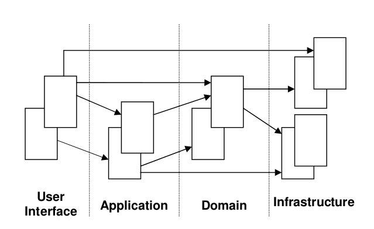
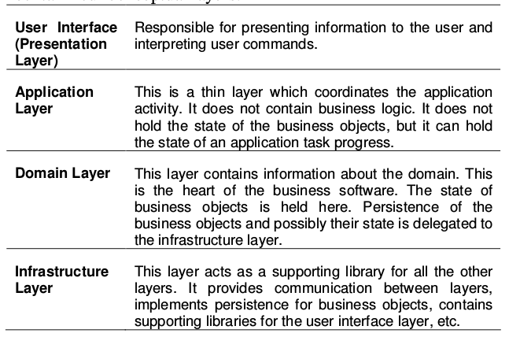

# Domain Driven Design Quickly - Avram A, Marinescu F

## 1. Chapter - What Is Domain-Driven Design
In order to create good software, you have to know what that software is all about. You cannot create a banking software system unless you have a good understanding of what banking is all about, one must understand the domain of banking.

How can we make the software fit harmoniously with the domain? The best way to do it is to make software a reflection of the domain.

We learn a lot about a domain while talking with the domain experts. But this raw knowledge is not going to be easily transformed into software constructs, unless we build an abstraction of it, a blueprint in our minds.

What is this abstraction? It is a model, a model
of the domain. According to Eric Evans, a domain model is not a particular diagram; it is the idea that the diagram is intended to convey.

And them _we need to communicate the model_.

Software design is like creating the architecture of a house, it’s about the big picture. On the other hand, code design is working on the details, like the location of a painting on a certain wall.

Domain Driven Design combines design and development practice, and shows how design and development can work together to create a better solution. Good design will accelerate the development, while feedback coming from the development process will enhance the design.

### Building Domain Knowledge
You start asking questions, and they respond. While they do that, they dig essential concepts out of the air traffic domain. Those concepts may come out unpolished and disorganized, but nonetheless they are essential for understanding the domain.

It is absolutely necessary to develop a model of the domain by having the the software specialists work with the domain experts

## 2 Chapter - The Ubiquitous Language

### The Need for a Common Language
To overcome this difference in communication style, when we build the model, we must communicate to exchange ideas about the model, about the elements involved in the model, how we connect them, what is relevant and what is not.

A core principle of domain-driven design is to use a language based on the model. Since the model is the common ground, the place where the software meets the domain, it is appropriate to use it as the building ground for this language. Make sure this language appears consistently in all the communication forms used by the team; for this reason, the language is called the **Ubiquitous Language**.

Building a language like that has a clear outcome: the model and the language are strongly interconnected with one another. A change in the language should become a change to the model.

### Creating the Ubiquitous Language

## 3 Chapter - Model-Driven Design
The Ubiquitous Language should be fully exercised throughout the modeling process in order to facilitate communication between the software specialists and the domain experts, and to discover key domain concepts which should be used in the model. The purpose of this modeling process is to create a good model. The next step is to implement the model in code.

- Analysis model
One of the recommended design techniques is the so called **analysis model**, which is seen as separate from code design and is usually done by different people. The analysis model is the result of business domain analysis, resulting in a model which has no consideration for the software used for implementation.

Such a model is used to understand the domain. A certain level of knowledge is built, and the model resulting may be analytically correct. Software is not taken into account at this stage because it is considered to be a confusing factor. This model reaches the developers which are supposed to do the design. Since the model was not built with design principles in mind, it probably won’t serve that purpose well. The developers will have to adapt it, or to create a separate design.

A better approach is to closely relate domain modeling and design. The model should be constructed with an eye open to the software and design considerations. Developers should be included in the modeling process. The main idea is to choose a model which can be appropriately expressed in software, so that the design process is straightforward and based on the model. Tightly relating the code to an underlying model gives the code meaning and makes the model relevant.

Any technical person contributing to the model must spend some time touching the code, whatever primary role he or she plays on the project. Anyone responsible for changing code must learn to express a model through the code. Every developer must be involved in some level of discussion about the model and have contact with domain experts.

### The Building Blocks Of A Model-Driven Design
The following sections of this chapter will present the most important patterns to be used in model-driven design. The purpose of these patterns is to present some of the key elements of object modeling and software design from the viewpoint of domain-driven design.

### Layered Architecture

When we create a software application, a large part of the application is not directly related to the domain, but it is part of the infrastructure or serves the software itself. It is possible and ok for the domain part of an application to be quite small compared to the rest, since a typical application contains a lot of code related to database access, file or network access, user interfaces, etc.

However, when domain-related code is mixed with the other layers, it becomes extremely difficult to see and think about. Superficial changes to the UI can actually change business logic.

A common architectural solution for domain-driven designs contain four conceptual layers:

The domain layer should be focused on core domain issues. It should not be involved in infrastructure activities.

### Entities
There is a category of objects which seem to have an identity, which remains the same throughout the states of the software. For these objects it is not the attributes which matter, but a thread of continuity and identity, which spans the life of a system and can extend beyond it. Such objects are called Entities. Implementing entities in software means creating identity.

### Value Objects
There are cases when we need to contain some attributes of a domain element. We are not interested in which object it is, but what attributes it has. An object that is used to describe certain aspects of a domain, and which does not have identity, is named Value Object.

It is necessary to distinguish between Entity Objects and Value Objects. It is not helpful to make all object entities for the sake of uniformity. Actually, it is recommended to select as entities only those objects which conform to the entity definition. And make the rest of the objects Value Objects.

Having no identity, Value Objects can be easily created and discarded. Nobody cares about creating an identity, and the garbage collector takes care of the object when is no longer referenced by any other object. This simplifies the design a lot.

It is highly recommended that value objects be immutable. They are created with a constructor, and never modified during their life time. When you want a different value for the object, you simply create another one. This has important consequences for the design. Being immutable, and having no identity, Value Objects can be shared.

### Services
To transfer money from one account to another; should that function be in the sending account or the receiving account? It feels just as misplaced in either. When such a behavior is recognized in the domain, the best practice is to declare it as a Service. **Such an object does not have an internal state, and its purpose is to simply provide functionality for the domain**.

Services act as interfaces which provide operations. A service is not about the object performing the service, but is related to the objects the operations are performed on/for. **In this manner, a Service usually becomes a
point of connection for many objects**. 

**A Service should not replace the operation which normally belongs on domain objects.**

We should not create a Service for every operation needed. But when such an operation stands out as an important concept in the domain, a Service should be created for it. There are three characteristics of a Service:

1. The operation performed by the Service refers to a domain concept which does not naturally belong to an Entity or Value Object.
2. The operation performed refers to other objects in the domain.
3. The operation is stateless.

### Modules
Modules are used as a method of organizing related concepts and tasks in order to reduce complexity.

Using modules in design is a way to increase cohesion and decrease coupling. Modules should be made up of elements which functionally or logically belong together assuring cohesion. Modules should have well defined interfaces which are accessed by other modules. Instead of calling three objects of a module, it is better to access one interface, because it reduces coupling. Low coupling reduces complexity, and increases maintainability.

### Aggregates
Domain objects go through a set of states during their life time. They are created, placed in memory and used in computations, and they are destroyed. In some cases they are saved in permanent locations, like a database, where they can be retrieved from some time later, or they can be archived.

Managing the life cycle of a domain object constitutes a challenge in itself, and if it is not done properly, it may have a negative impact on the domain model. We will present **three patterns** which help us deal with it. **Aggregate is a domain pattern used to define object ownership and boundaries**.