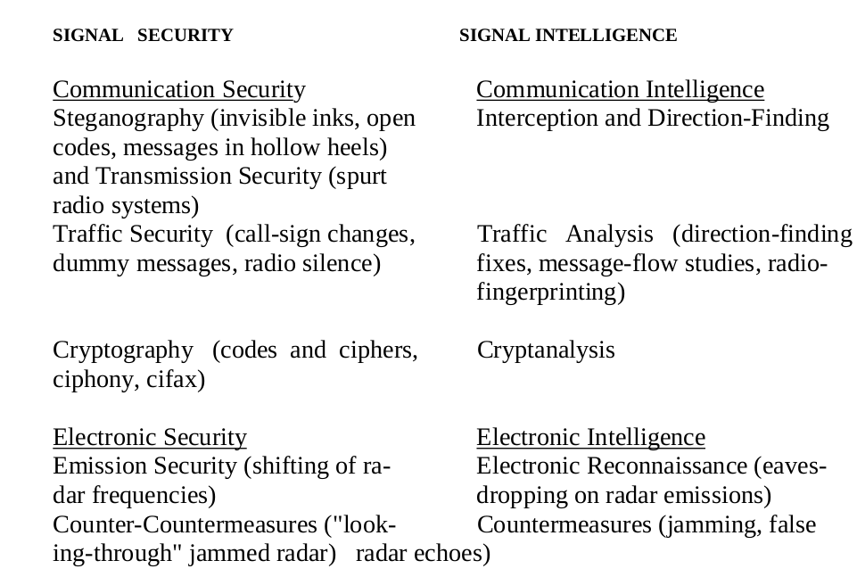

# THE CODEBREAKERS - KAHN, DAVID

## A few words

- Transposition: _secret_ -> ETCRSE
    In transposition letters retain their identities but they lose their positions.
- Substitution: _secret_ -> 19 5 3 18 5 20 or XIWOXY
    In substitution the letters retain their positions but lose their identities.

Transposition and substitution may be combined.

Substitution system are much more diverse and important than transposition systems. They rest on the concept of the **cipher alphabet**. A sample **cipher alphabet** might be:

    plaintext letters abcdefghijklm
    cipher letters LBQACSRDTOFVM
    plaintext letters nopqrstuvwxyz
    cipher letters HWIJXGKYUNZEP

Indicating that letters of the plaintext will be replaced by the cipher letter: _enemy_ -> CHCMY

- **Homophones** are alternates were a plaintext _e_ instead of being replaced by only one value, say 16, can be replaced by any one of the figures 16, 74, 35, 21.
- **Nulls** are symbols that mean nothing and are intended to confuse interceptors.
- **Monoalpbabetic** is when only one cipher alphabet is in use.
- **Polyalphabetic** is when two or more ciphers alphabets are employed in some kind of prearranged pattern. A simple form of polyalphabetic substitution would be to add another cipher alphabet under the one given above and then to use the two in rotation, the first alphabet for the first plaintext letter, the second for the second, the first again for the third plaintext letter, the second for the fourth, and so on. Modern cipher machines produce polyalphabetic ciphers that employ millions of cipher alphabets.
- **Code** is distinguished from cipher. A code consists of thousands of words, phrases, letters, and syllables with the codewords or code-numbers that replace these plaintext elements:
        ```
            plaintext       codeword
            emplacing       DVAP
            employ          DVBO
        ```
        If the plaintext and the code elements both run in alphabetical or numerical order, as above, the code is a **one-part code**. If, however, the code equivalents stand in mixed order opposite their plaintext elements the code is a **two-part code**.

In a sense, a code comprises a gigantic cipher alphabet, in which the basic plaintext unit is the word or the phrase; syllables and letters are supplied mainly to spell out words not present in the code. In ciphers, on the other hand, the basic unit is the letter.

- **Cryptogram** is the final secret message, wrapped up and sent.
- To **decipher** or **decode** is for the persons legitimately possessing the key and system to reverse the transformations and bare the original message.
- **Cryptanalyze**is when the person who do not possess the key or system— a third party, the "enemy"—break down or solve the cryptogram.
- **Cryptanalysis** mean the methods of breaking codes and ciphers.
- **Cryptology** is the science that embraces cryptography and cryptanalysis, but the term "cryptology" sometimes loosely designates the entire dual field of both rendering signals secure and extracting information from them.



## 1. One Day of Magic: I
