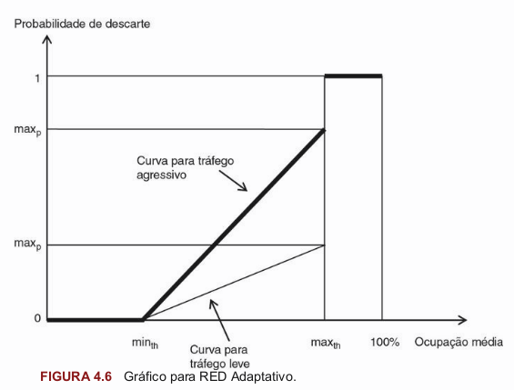

# QoS - Qualidade de Serviço em Redes de Computadores

## Capítulo 1

### Seção 1.4

#### Camada IP


- Um datagrama é recebido pela camada de enlace da interface de rede
- De acordo com o número no campo _Header Length_ a rotina adequada para processamento é ativada
- Verifica-se o endereço IP de destino. Caso seja ele prório, o pacote é enviado para a camada de transporte. Caso não seja o datagrama é encaminhado para a "frente".
- Um roteador tem várias interfaces e o pacote geralmente entra por uma e sai por outra. Para saber em qual interface o roteador deve empurrar o datagrama, consulate-se a **tabela de roteamento**.
- Para manter a tabela de roteamento atualizada, usa-se os comandos route e netstat.


### 1.5 Atraso Notáveis
Atrasos impostos ao datagrama no seu trânsito pela rede:
- **Atraso de propagação**: Inerente à velocidade com que o sinal viaja de um ponto ao outro. Pode-se assumir que é praticamente a velocidade da luz 300.000 km/s. 
    - Quando suário tentar acessar um site próximo, o atraso é mínimo. No entanto se o site estiver no Japão o atraso será consideravel.
    - Quando a conexão se faz via satélite. Satélites geoestacionários estão a aproximadamente 36.000 km da terra. Sendo assim, um sinal de radio precisará percorrer duas vezes essa distância.
    - **Um atraso superior a 300ms implica em uma perda de interatividade**
- **Atraso na transmissão**: à largura de banda disponível em todo o percursso origem-destino. Desde o primeiro bit transmitido na origem até que o último bit acabe de entrar no destino.
- **Atraso de fila**: grande ofensor das comunicações por comutação de pacotes. Dado que um datagrama atravessa vários roteadores até chegar ao seu destino, e que em cada roteador ele vai passar por uma fila, e que cada fila tem um comportamento altamente aleatório.
- **Atraso de processamento**: Tempo gasto para um datagrama ser processado, isto é, ter seu cabeçalho decomposto e analisado por cada roteador no trajeto origem-destino, consulta à Tabela de Roteamento, envio na interface apropriada.
- **Atraso de transporte**: mecanismos de controle de congestionamento do TCP. Uma
conexão TCP inicia no modo slow-start, aumentando a carga de tráfego exponencialmente. Quando é detectada a perda de um pacote, o TCP para, espera por um pouco de tempo e reinicia no modo slow-start. Além disso, no caso de perda de um segmento, o TCP reenvia o segmento perdido até obter uma confirmação (ACK) do host de destino.
- **Atraso de cofificação/decodificação**: Quando a aplicação é voz e/ou vídeo,
temos um atraso adicional, que é a Amostragem, Quantização, Codificação e
Compressão do sinal (tudo isso chamado de Codificação)

### 1.6 Modelos de Camadas
A representação dos protocolos de comunicação mais usual é em forma de pilha, em que existem várias camadas, cada uma agregando as funções mais comuns àquela camada.


### 1.6.1 Camada Física
Já dissemos que uma rede de computadores é composta de equipamentos terminais,equipamentos de roteamento e os enlaces que ligam essesequipamentos entre si.Portanto, a primeira coisa que pensamos é como interligar os equipamentos.

### 1.6.2 Camada de Enlace
As conexões físicas estão sujeitas a toda a sorte de problemas. Quando elas são externas nas ruas em cima de pares
telefônicos, sujeitos a umidade, raios, interferências eletromagnéticas da rede de
energia elétrica (normalmente os cabos telefônicos compartilham os postes das
concessionárias de energia elétrica) etc., é preciso se cuidar para que a
transmissão de dados sobreviva a esses vários fatores. Quando o meio é via fibra
ótica, as interferências eletromagnéticas não são significativas, mas estão
sujeitas a serem rompidas por obras nas ruas e rodovias do país, onde
normalmente elas são lançadas enterradas no acostamento.

É preciso, então, prover meios de detectar se os dados transmitidos foram corrompidos por ruído ao longo do percurso entre dois equipamentos, providenciar sua repetição ou correção, se necessário, e, se houve queda do meio, alertar o usuário.

O meio físico de propagação (seja ele fio metálico, ondas de rádio ou fibra ótica) apresenta características que provocam uma deformação no pulso (quadrado) à medida que ele se desloca no meio.


Se transmitirmos pulsos rapidamente, eles ficarão muito próximos uns dos outros, e a distorção de cada um deles vai invadir o espaço do outro causando o que se chama interferência entre símbolos.


O que vemos é que o receptor recebe duas formas de onda que se sobrepõe. Como o circuito decisor faz amostragens na velocidade do clock estipulado para linha (p. ex., 64 kbps), ele deve amostrar em fase com os pulsos 1, 1 e 1, pois no instante em que não deveria haver pulso, bit 0, ele detecta a soma das duas formas de onda e essa soma pode ser superior ao limite de decisão. Logo, um erro de transmissão ocorrerá.

É preciso usar uma velocidade de transmissão compatível com a qualidade do meio por onde se propaga o sinal.

Entre a funções que devem ser desempenhadas para garantir uma transmissão livre de errors:
- Delimitação de quadros
- Detecção de erros
    - Várias são as técnicas de detecção de erro. As mais usadas são os códigos de redundância cíclica, ou CRC, em que o fluxo de bits a ser enviado é associado a um polinômio (cada bit é o coeficiente de um termo do polinômio), que é dividido por um polinômio gerador conhecido de ambos os lados, transmissor e receptor. O resto dessa divisão é acrescentado ao quadro a ser transmitido. Ao chegar ao receptor, este divide o “polinômio” que chegou pelo polinômio gerador e compara o resto que obteve com o que veio junto com o quadro. Se os restos forem iguais, o receptor acredita que o fluxo de bits foi transmitido sem erros, ou seja, não está corrompido. Se forem diferentes, ele entende que o que recebeu não é o que foi enviado.
- Correção de erros
    - Na técnica de correção de erro, o receptor não só detecta que houve erro na transmissão, como também corrige o quadro recebido sem necessitar de retransmissão. Para isso, o transmissor envia o mesmo quadro duas vezes. Só que o segundo quadro não é idêntico ao primeiro, pois passa por um algoritmo que otimiza a tarefa de correção do erro. Essa técnica é chamada de FEC, Forward Error Correction.
- Controle de fluxo.


Vamos lembrar, ainda, que um enlace pode ser **simplex**, **half-duplex** e **duplex** (ou full-duplex). No simplex, quando o transmissor envia, o receptor fica desativado. Quando é hora de receber, o transmissor é que fica desativado. Essa modalidade é muito usada em radioamadorismo, quando o operador tem que dizer a palavra
“câmbio” ao final de sua fala de modo que o outro lado sabe que, agora, é sua hora de falar. Então ele aperta a tecla PTT (Push to Talk) para ativar o transmissor, desligando o receptor, e transmite sua mensagem. No modo half-duplex, o transmissor e receptor estão ativados, mas não operam ao mesmo tempo. Um tem que esperar o outro terminar para entrar. No modo duplex, ou full-duplex, é possível haver transmissão ao mesmo tempo em que se recebem sinais.


### Os protocolos mais usados nessa camada são:

Para redes locais (LANs)
- Ethernet

Para acessos urbanos:
- O PPP (Point-to-Point Protocol)

### 1.6.3 Camada de Rede

### 1.6.4 Camada de Transporte

## Conceitos Básicos de Qualidade de Serviços em Redes

### 2.1 Elementos envolvidos no QoS
QoS se refere a prover a rede de técnicas que permitam trafegar com velocidade e confiabilidade. Normalmente quando se fala de QoS em uma rede temos que classificar:
    - _End-to-End_: máquina-origem à maquina-destino
    - _Edge-to-Edge_: somente dentro do backbone.

Qualidade de serviço em uma rede é muito mais do que a qualidade do backbone. É a qualidade percebida pelos usuários da rede. Sendo assim, os **componentes que interferem na qualidade da rede** são:

1. **Hardware**: capacidade insuficiente dos servidores, PC, etc. Conectores de baixa de qualidade. Discos pequenos e/ou com grande tempo de resposta. RAM insuficiente. Interface usada nos periféricos.
2. **Software**: Servidores e banco de dados mal configurados. Aplicativos mal feitos do ponto de vista de consumo de banda da rede.
3. **Link**: Enlaces contratados de empresas provedoras de meios de comunicação que estão mal dimenionados ou foram contratados com capacidade inferior à necessaria, visando diminuir os custos. Enlaces de má qualidade apresentando muito ruído, causando um BER (bit error rate) alto. 
4. **Disciplina de uso da rede**: o comportamento dos usuários da rede tem sido motivo de várias notícias envolvendo até demissões. O uso abusivo da rede das empresas para enviar e-mails com anexos enormes (como videoclipes) congestiona os links e servidores de e-mail, tornando o uso dos aplicativos vitais ao funcionamento das empresas lento e irritante, impactando,
diretamente, a produtividade dos funcionários, além de aplicativos tipo torrent, Peer to Peer.
5. **Fator Humano**: pessoal de informática desenvolve novos aplicativos (e os testa em rede) sem avisar ao pessoal de telecomunicações. Isso acarreta uma sobrecarga não prevista que faz com que os aplicativos usualmente utilizados fiquem lentos gerando reclamações ao pessoal de telecomunicações. Estes, sem saber da sobrecarga, culpam os provedores dos acessos, que perdem um tempo (e dinheiro) enorme pesquisando eventuais falhas e/ou sobrecargas em seus backbones. Até se perceber que o problema está dentro do cliente, já se passaram muitos dias, muitas broncas dos usuários e, pior, da diretoria. O desgaste atinge a todos.

## 2.2 Parâmetros do QoS
Qualidade fim a fim = (qualidade edge-to-edge) + (qualidade do acesso urbano)

Qualidade edge-to-edge =  (qualidade de cada enlace entre roteadores) * x

Há 3 parâmetros com os quais devemos nos preocupar quando pensamos em qualidade: 
- Atraso fim a fim (ou latência)
    - O atraso (delay) é um ofensor de comunicações interativas, tais como videoconferência e VoIP.
- Jitter (variação aleatória da latência)
    - Os dispositivos de decodificação na extremidade receptora esperam receber as amostras de voz em intervalos regulares para que possam recompor a fala original. Depois do atraso do primeiro pacote, é necessário que os próximos datagramas cheguem com o mesmo atraso absoluto com relação à emissão do pacote, o que proporcionaria um intervalo de tempo constante entre os datagramas (que transportam amostras de voz). Na realidade, isso não ocorre. Cada datagrama é afetado por atrasos diferentes, o que faz com que o intervalo entre chegada das amostras seja ora menor ora maior. Se essa diferença (jitter) for muito severa, o algoritmo do decodificador fica impossibilitado de recompor a voz original, ocasionando interrupções e clicks irritantes.
- Perda de pacotes.
    - A perda de pacotes tem o efeito de um atraso infinito no pacote perdido. Quando o decodificador não recebe a amostra esperada dentro de um tempo máximo que permita usar a amostra na recomposição do sinal, é necessário substituir o pacote perdido por uma estimativa.

### 2.3 Tipos de Tráfego
O IPv4 provê mecanismos para classificar os datagramas de acordo com o tipo de tráfego que ele transporta. Essa indicação é feita no campo do cabeçalho IP, chamado TOS (Type of Service). Esse campo define se o pacote precisa de :
- Rapidez na entrega(ou mínimo atraso)
- Garantia de entrega, mesmo que demore (reliability)
- Máxima vazão
- Mínimo custo


Esses 4 tipos de tráfego são considerados insuficientes para classificar os pacotes que passam na rede. Uma classificação mais completa se dá por meio da análise dos campos:
- endereço IP de origem;
- endereço IP de destino;
- tipo de protocolo (UDP ou TCP);
- número da porta de origem;
- número de porta de destino.

Essa forma de classificação é chamada de Multicampo (Multifield Classification, MF). Dessa forma, classificaremos por fluxo, ou seja, por aplicação.

E.g.
- VoIP
    - Tolerante a perda de pacotes
    - Exige baixa latência
    - Sugestão: use UDP
- E-mail
    - Tolerante a latência
    - Não tolera perda de pacotes
    - Sugestão: use TCP

### 2.4 A importância de uma rede com QoS
Antigamente, havia um único tipo de fila para atender todos os tipos de clientes.

Uma solução seria se os roteadores em uma rede IP também pudessem tratar diferentemente datagramas com diferentes requisitos. Para fazer isso, seria necessário que o datagrama, ao entrar em um roteador, fosse classificado. Após a classificação, ele seria encaminhado para uma fila específica para datagramas com voz, outra para datagramas com e-mail etc. Essa é a solução mais simples e natural que se poderia adotar. Uma vez colocados os datagramas em suas filas específicas, é preciso haver um mecanismo que trate cada fila no modo FIFO, mas cada fila seria servida diferentemente, de acordo com sua classe. Ou seja, cada fila seria tratada de forma diferenciada.
- **Classification**: classificação dos pacotes na entrada do roteador.
- **Queueing**: enfileiramento e processamento dos pacotes nas suas filas.
- **Scheduling**: serviço oferecido a cada fila

Os roteadores capazes de executar essas  3 tarefas são chamados roteadores capazes de CQS.


### 2.5 Mais técnicas para obtenção de QoS
#### 2.5.1 Smart Edge/Dumb Core
Os edge-routers (roteadores de borda) são responsáveis por receber tráfego dos clientes. Não possuem muito tráfego, portanto é atribuído a eles mais tarefas no tratamento de pacotes. Sendo chamados de **smart**.

Os core-touters (roteadores do núcleo da rede) são responsáveis por rotear uma quantidade muito grande de datagramas que vêm dos edge-routers. Possuem alto tráfego, porém fazem menos tarefas para que não percam em desempenho. Sendo chamados de **dump**.

O objetivo é restringir fluxos agressivos na entrada da rede para preversar o núcleo. Assim, os roteadores de borda fazem classificação Multicampo (MF) e, por meio de uma função hash codificam essa classificação em um número menor de classes através do DSCP, que é o que os core-routers analisam.

#### 2.5.2 Policing
O tráfego de um dado cliente é analisado em intervalos regulares e, se ele apresentar tráfego maior do que o permitido naquele intervalo de tempo, então os datagramas excedentes são simplesmente descartados, não entrando para o núcleo da rede.

#### 2.5.3 Marking
Uma técnica menos agressiva é marcar o pacote, em vez de descartá-lo. Dessa
forma, nos roteadores do interior do núcleo, caso haja necessidade de descarte
devido a congestionamento, esses pacotes marcados são descartados primeiro.

#### 2.5.4 Metering
Para executar o Policing ou Marking é preciso checar quais pacotes que chegam a mais do que um determinado perfil contratado com o cliente ou estabelecido pela política de administração da rede, é preciso medir o tráfego que chega. Isso é Metering.

O método mais usual é o **Token Bucket**:

1. Tokens são gerados a taxas constantes e colocados em um balde;
2. Cada pacote que chega remove um token do balde;
3. Se não chegarem pacotes, os tokens vão enchendo o balde até certo ponto;
4. Se chegarem pacotes a uma taxa, menor que a taxa de geração de tokens, o balde permanece com alguns tokens;
5. Se aconteceer de chegarem pacotes a uma taxa maior do que a de geração de tokens por um período prolongado, então o balde esvazia. Dai para frente, os pacotes que chegam são marcados ou descartados.
6. Se a rajada de pacotes voltar a taxas bem comportadas, os token voltam a ocupar o balde e os novos pacotes são admitidos

Tendo um Token Bucket para cada classe.


#### 2.5.5 Traffic Shaping
O tráfego IP é caracterizado por sua imprevisibilidade e por ocorrer em rajadas (bursts). Esse comportamento é totalmente indesejável, pois faz com que seja impossível dimensionar links e buffers dos
roteadores para um tratamento mais previsível do desempenho da rede como um todo. Desse modo, é uma solução natural tentar “domar” o tráfego que chega do cliente no momento de sua entrada no backbone. O traffic shaping (modelagem do tráfego) faz exatamente isso. O tráfego chega em rajadas e é enfileirado para ser servido pelo roteador, ou seja, ser encaminhado na interface apropriada. No entanto, o scheduller do roteador só envia pacotes no link em intervalos de tempo determinados removendo, assim, o comportamento bursty do tráfego.

Algumas literaturas se referem a esse processo como leaky bucket (balde furado). Não importa quanta água cai no balde, o fio de água que vaza pelo furo permanece constante.


### Engenharia de Tráfego (Traffic Engineering)
Qualquer medida tomada no sentido de melhorar o tráfego na rede. Umas dessas medidas é o uso de roteamento de melhor caminho e não de menor caminho.

#### 2.6.1 Signaling (Sinalização)
Para haver uma coordenação em termos de obter uma qualidade edge-to-edge, necessitamos de alguma forma de comunicação que possa anunciar aos componentes da rede as necessidades de recursos para trafegar um determinado fluxo, bem como necessitamos que os componentes respondam se são capazes, ou não, de atender aos requisitos estipulados. (RSVP, DiffServ, IntServ)

#### 2.6.2 Provisioning (Provisionamento)
É um tipo de signaling, só que é o resultado da atuação de um operador da rede. Enquanto o signaling é automático, o provisioning depende de uma decisão do administrador para que se possa intervir na rede visando evitar situações que podem levar a congestionamentos e/ou balancear o tráfego.

### 2.7 Influência dos protocolos

## 3. Qualidade Por Enlace
Há, basicamente, três grandes categorias de enlaces:

1. os enlaces internos às dependências do usuário;
2. os enlaces que ligam a rede do cliente ao backbone do provedor de WAN;
3. os enlaces que ligam os roteadores do backbone entre si.

No terceiro caso, a tecnologia preferencial usada é a fibra ótica. Em algumas situações, usa-se satélite, em que a fibra ótica é inviável economicamente (ou tecnicamente) de ser oferecida. 

No caso da ligação do clientes ao seu provedor, o famoso last-mile, podemos lançar mão de várias soluções:

- Par telefônico (metálico), que é o caso do acesso discado, ADSL (Asymmetric Digital Subscriber Line) e RDSI (Rede Digital de Serviços Integrados).
- Cabo de empresas de TV a cabo.
- Rádio micro-ondas na faixa milimétrica, ou seja, com portadoras de RF (radiofrequência) de 11 GHz a 23 GHz, entre outras possíveis (muito usadas em áreas urbanas onde as faixas frequências de micro-ondas já estão esgotadas, além de serem práticas de instalar por possuírem antenas de pequeno diâmetro semelhantes às antenas de TV por assinatura via satélite).
- Rádios ponto-multiponto, normalmente trabalhando em frequências de UHF (Ultra High Frequency) alto, ou seja, com portadora de RF em torno de 800 MHz.
- Equipamentos óticos em espaço aberto para uso entre prédios de escritórios em grandes cidades.
- Equipamentos óticos confinados em fibra ótica (nesse tipo de solução, as empresas provedoras do acesso urbano lançam anéis óticos nas áreas de maior demanda das cidades, providenciando pontos de agregação com equipamentos que recebem o rabicho ótico que alcançará o cliente).
- Uso da rede de energia elétrica para transmissão dos sinais digitais (essa é uma ideia antiga que, vez por outra, ressurge para depois entrar em esquecimento devido a inúmeros problemas que não vêm ao caso neste trabalho).
- Uso de sistemas via satélite especializados para essa aplicação que, mesmo em áreas urbanas, encontram aplicação quando o cliente está em uma região não atendida por par metálico, fibra ótica ou quando há obstrução entre ele e seu provedor (soluções via rádio micro-ondas exigem que haja visibilidade entre as antenas).
- Acessos wireless (sem fio) onde se sobressaem o WiMax (em torno de 25 km).
- Telefones celulares 3G e, chegando, o 4G, que deverá se basear no novo protocolo LTE (Long Term Evolution)


Os fatores que mais comprometem a integridade de um sinal em um meio metálico são:

- Perda de inserção — deve ser inferior a 15 dB para um sinal de referência de 800 Hz.
- Resistência de Loop — deve ser inferior a 2.300 ohms.
- Isolamento — deve ser superior a 40 MOhms.
- Ruído — menor que 43 dbm0p, sem portadora.
- Relação Sinal/Ruído (S/N) — deve ser maior que 24 dB (para transmissão analógica) e maior que 40 dB (para transmissão em banda básica) sobre 800 Hz.
- Distorção harmônica — os níveis dos harmônicos da portadora deverão estar 25 dB, ou mais, abaixo do nível da portadora (tomado como 0dBm).
- Distorção de retardo de grupo — deve ser inferior a 1,00 ms.
- Distorção de amplitude.
- Ruído impulsivo — contado toda vez que o nível de ruído for superior a -18dBm0 (são admitidas contagens inferiores a 18, a cada 15 minutos).
- Interrupções — quando o nível do sinal cai abaixo de certo limiar por mais de 3 ms, após ter ficado mais que 125 ms no nível normal.
- BER (Bit Error Rate) — melhor que 10 -6 .

## 4. Qualidade por Roteador
Cada pacote que entra é examinado para ver o endereço IP de destino, é consultada a Tabela de Roteamento, que diz em qual interface o dito pacote deve ser enviado para o próximo roteador, seja lá qual for. Para desempenhar essa função, o roteador dispõe de um buffer. Precisamos, então, de roteadores que possam identificar o tipo do pacote e dar a ele tratamento diferenciado.

A solução atual para dotar os roteadores dessa capacidade é chamada de **CQS (Classification, Queueing, Scheduling)**. O roteador deve:

- Classificar todos os pacotes que entram de acordo com algum critério. Em seguida, é preciso tratar com a prioridade adequada o pacote já classificado.
- Para isso, criam-se filas separadas, uma para cada classe de pacote.
- Depois de separadas em filas, por classe, os pacotes são enviados na interface indicada pela Tabela de Roteamento, de acordo com alguma disciplina de atendimento. Por exemplo, os pacotes das filas com maior prioridade são enviados primeiro que os das outras filas. A isso dá-se o nome de Agendamento, Escalonamento ou Scheduling.

### 4.1 O C de classificação

Há 3 maneiras de classsificar um pacote em nível de rede:
1. Observando-se os campos TOS do cabeçalho IP. (Seção 2.2 Parâmetros do QoS)
2. Mudando-se o campo TOS para outra distribuição. A esse campo reinterpretado dá-se o nome, agora, de DS (Differentiated Service). Essa classificação é feita normalmente na origem, pela aplicação do próprio usuário, pelo que se deve ter cuidado para evitar tráfego não contratado.
3. Observando-se mais campos do que os dos itens anteriores. Na realidade, observam-se os campos Endereço IP de Origem, Endereço IP de Destino, Protocolo (TCP ou UDP), Número da Porta de Origem e Número da Porta de Destino. Esse tipo de classificação nos permite, examinando um pacote que passa em um roteador qualquer, saber de que máquina ele saiu, para qual máquina ele vai, qual o protocolo que usa e os endereços da porta de origem e destino. Ou seja, podemos identificar a qual aplicação cada pacote pertence, ainda que sejam originados e terminados nas mesmas máquinas (hosts). A isso chama-se fluxo (flow). Temos aí uma classificação por fluxo. Dá para imaginar que em um roteador passam milhares de fluxos, o que acarreta criar milhares de filas em cada roteador.


### 4.2 O **q** de enfileiramento
O gerenciamento das filas torna-se mais complexo devido a existência de várias filas. As funções de gerenciamento de uma fila podem ser descritas por:

- Colocar o pacote na fila indicada pela etapa de classificação;
- Descartar o pacote se a fila estiver cheia;
- Remover o pacote quando chega sua hora de entrar no link
- Monitorar a ocupação da fila, descartando ou mrcando pacotes de acordo com a política adotada

O **monitoramento da ocupação** da fila tem 3 **finalidades**:
- Manter a ocupação baixa: filas muito cheias perdem a capacidade de absorver muitos pacotes ao mesmo tempo.
- Manter a latência baixa: a latência de um pacote dentro de um roteador aumenta na proporção da quantidade de pacotes a serem servidos antes dele. Filas com baixa ocupação resultam em baixa latência.
- Diminuir a probabilidade de um pacote ser descartado: Tal probabilidade aumenta com o aumento da ocupação da fila. Isso é um grande problema, especialmente tratadon-se de TCP, pois a perda do pacote fará com que a condição _slow-start_ seja acionada. Pode, inclusive, acontecer um efeito de sincronismo em que todos os TCP de origem retornam ao slow-start ao mesmo tempo. Assim, a fila que estava congestionada fica, de repente, vazia, ou quase.

O ideal é não perder paotes, ou manter a perda no mínimo possível. Para isso é necessário gerenciar a fila e adotar medidas para evitar o congestionamento da fila.

Tomemos algum roteador no meio de um backbone. Seu sistema de gerência de fila acusa uma fila com uma ocupação alta (utilização alta). Esse roteador precisa avisar isso à fonte de tráfego para que ela diminua sua taxa de geração de pacotes (tirar o pé do acelerador). O IPv4 só provê o sistema de perda de pacote de modo que o TCP de origem possa “tirar o pé do acelerador”. Mas já vimos que é melhor agir antes de perder pacotes. Então é necessário implementar alguma forma de o roteador marcar um pacote na direção da origem para avisá-la de que precisa “baixar um pouco a bola”. Em seguida, vamos apresentar a técnicas usuais para implementar esse mecanismo.

#### ECN (Explicit Congestion Notification)
Notificação Explícita de Congestionamento

O Frame Relay já traz em seu projeto original esse tipo de mecanismo, só que se chama FECN (Forward ECN) e BECN (Backward ECN) que são setados em um quadro quando de sua passagem por um nó de roteamento, avisando se o congestionamento é na direção em que o quadro está indo ou na direção contrária.

### 4.2.1 RED (Random Early Detection)

RED sinaliza congestionamento bem antes que a fila fique cheia. A solução atual para gerenciar uma fila é enviar uma mensagem para os originadores de pacotes de modo que eles diminuam sua atividade. O modo mais simples de fazer isso é descartando um pacote, de modo que o TCP remetente volte para a fase de _slow-start_. Em cada roteador é realizado o cálculo da ocupação média para os diversos fluxos presentes na fila. Além de realizar a realimentação negativa, essa realimentação tem uma intensidade que é proporcional à ocupação da fila. Quanto mais ocupada maior a realimentação.

Cada vez que chega um pacote, o cálculo abaixo é executado:


Onde o resultado é a média móvel.


O eixo vertical representa a probabilidade de descarte do pacote. O eixo horizontal representa  a ocupação média recém-calculada.

Alguns autores chamam a primeira fase de normal. A segunda fase é chamada de congestion avoidance (algo como evitar congestionamento) e a terceira fase é chamada de congestion control. Os pesos para Q inst e Q avg fazem com que RED ignore rajadas de curta duração, mas reaja a níveis prolongados de ocupação.

### 4.2.2 WRED (Weighted RED)
Nessa forma, a Curva de Descarte tem duas retas diagonais:uma para pacotes marcados (M) e outra para pacotes sem marca (Un).


Duas retas, uma para os pacotes comuns (não marcados) e outra (tracejada) para pacotes que chegaram já marcados em algum roteador anterior. Note que a reta tracejada, para pacotes marcados, é mais agressiva, começando o descarte para Ocupações Médias da fila menores do que no caso convencional.

### 4.2.3 RIO (RED with In/Out)
Nessa variação, a média de ocupação da fila é feita tanto para pacotes que entram quanto para os que saem do roteador. RIO pressupõe marking dos pacotes por roteadores upstream. A novidade, aqui, é que a função EWMA é modificada pelo bit de marking e não somente pelos valores de threshold (th).

### 4.2.4 ARED (Adaptative RED)
Essa é uma modalidade de RED que ajusta o valor de maxp baseado em variações recentes de Qavg de modo a ter um descarte de pacote mais agressivo se Qavg fica acima de maxth e menos agressivo se abaixo de minth.



O ARED modifica os parâmetros do RED baseado na história recente do congestionamento (ocupação média da fila). Para isso, o ARED ajusta maxp baseado nas variações recentes de Qavg.

- Se Qavg oscila em torno de minth, a rampa diminui sua inclinação, tornando o descarte de pacotes menos agressivo.
- Se Qavg oscila em torno de maxth, a rampa aumenta sua inclinação, tornando o descarte de pacotes mais agressivo.

### 4.2.5 FRED (Flow RED)
Trabalha em cima de fluxos. Considera as seguintes caracterizações:

1. Fluxos não adaptativos — protocolos de transporte que ignoram perda de pacote (por exemplo, UDP).
2. Fluxos robustos — conexões TCP com RTT (Round Trip Time) de curta duração e que, portanto, reagem rapidamente a perdas de pacotes.
3. Fluxos frágeis — conexões TCP com grande RTT e que, portanto, demoram a reagir à perda de pacotes.

O FRED ajusta o comportamento de perda de pacote com base em dados recentes por fluxo (só para os fluxos que têm pacotes na fila em algum momento).


## 4.3 O S de agendamento
O módulo de scheduling vai atender cada fila criada (uma para cada classe) encaminhando o pacote da vez no link pertinente. A maneira como esse serviço será feito é chamada de Disciplina de Serviço. 

Disciplinas de Serviço
Para filas simples, as disciplinas já são conhecidas:
- FIFO (First In, First Out), ou o Primeiro que Entra é o Primeiro que Sai;
- LIFO (Last In, First Out), ou o Último que Entra é o Primeiro que Sai;
- Priority Queueing, ou Atendimento por Prioridade.

Para múltiplas filas, o agendador atende as filas conforme as disciplinas

### 4.3.1 Prioridade Escrita
Suponhamos 4 filas em que a fila #1 é a de maior prioridade, a #2 de menor prioridade que 1, a fila #3 tem prioridade menor que 2 e a fila #4 é a com menor
prioridade de todas. Nessa disciplina de atendimento, o scheduler só vai atender a fila 2 quando a fila 1 estiver vazia. A fila 3 só será servida quando a fila 2 estiver vazia, e assim por diante. E fácil perceber que, se a fila 1 tiver sempre pacotes para serem servidos, as demais filas vão ficar sem serviço.

### 4.3.2 Roud-Robin (RR)
Nesta disciplina de atendimento, as filas nunca ficam sem serviço porque o scheduler fica varrendo todas elas. Se houver uma fila vazia, ela será pulada para atendimento da próxima agendada. O agendamento pode ser feito, por exemplo, na ordem 1 > 2 > 1 > 3 > 1 > 4. Vemos que a fila 1 é atendida mais vezes e tem grande prioridade com relação às demais. A ordem de agendamento depende da prioridade que se quer dar a cada fila.

### 4.3.3 Agendamento Adaptativo
Uma vez que os pacotes IP têm tamanhos diferentes, efetuar uma disciplina de atendimento que seja justa, em termos de pacotes servidos nas filas, não resulta em um atendimento justo em termos de bits no link, que é o que interessa, afinal. É preciso, então, uma disciplina que leve em consideração a quantidade de bits transmitidos cada vez que uma fila é servida. Os algoritmos que melhor têm desempenhado essa função são Deficit Round Robin (DRR), Fair Queuing (FQ) e Weighted Fair Queuing (WFQ).

### DRR
Evolução do RR que monitora quando bytes foram enviados de uma dada fila, compara com o número de bytes que deveriam ter sido enviados e atribui um crédito ou déficit. Esse déficit é usado para alterar o intervalo com que a dada fila é atendida. A cada fila é atribuido um quantum Q e um valor variável D (déficit). Q representa o número de bytes que se permite à fila n compartilhar a banda total do link. D é inicializado com o valor 0 para todas as filas e volta a zero sempre que a fila fica vazia.

```
# 1 byte = 8 bits
# Pacotes
# | 512 | 100 | 256 | 256 | 512 | 512 |

V = 16Kbps
Q = 1/2*V      # 1KBps
Bsent = 0

for fila in filas:
    D = Q
    while fila.pacotes.exists():
        newD = Q - Bsent
        if D - Bsent >= fila.pacotes.first().size():
            Bsent = Bsent + fila.pacotes.first().size()
            send(fila.pacotes.first())
            remove(fila, fila.pacotes.first())
        else:
            D = newD + Q
            Bsent = 0
    Bsent = 0
```

### 4.3.4 FQ e WFQ


## 5 Qualidade no Backbone

### 5.1 Características do backbone
#### 5.1.1 Roteamento pelo menor caminho
Atualmente, os backbones IP da maioria dos provedores mantêm as Tabelas de Roteamento dos roteadores que constituem suas redes por meio do protocolo OSPF (Open Shortest Path First). Se surgisse um protocolo de roteamento chamado OBPF (Open Best Path First) para substituir o OSPF, então teríamos um roteamento baseado no melhor caminho, e não no menor caminho. A
saída mais simples é gastar mais dinheiro superdimensionando os links e os roteadores.

# 5.1.2 Redes Virtuais Privativas ou VPN (Virtual Private Network)
Fazem parte de um grande movimento nas empresas de adotar essa solução para compor suas redes corporativas (intranets). Com a chegada comercial das plataformas IP, muitos clientes começam a migrar suas redes para IP criando as intranets. No entanto, a
plataforma IP é vulnerável a ataques de hackers, e muitos clientes têm medo de expor seus procedimentos internos, dados financeiros e planejamentos por uma
rede que tem uma alta probabilidade de ser invadida possibilitando com que seus dados sigilosos sejam capturados. A solução para isso é usar o protocolo IPsec, que cria um túnel entre duas localidades, isolando, assim, a rede IP pública sobre a qual se apoia. Some-se ao túnel o uso de criptografia e teríamos resolvido o problema. Teríamos, se não fosse o alto custo do IPSec, além de requerer roteadores mais poderosos (e caros) em termos de rapidez de processamento e aumento de memória RAM.

A saída passou a ser contratar o Frame Relay como camada de enlace e colocar o protocolo IP (junto com o TCP e UDP) em cima do Frame Relay. Assim, teríamos o benefício de um túnel, que é nativo do Frame Relay, isolando o tráfego corporativo. Além disso, o Frame Relay tem, por concepção, mecanismos para evitar congestionamento na rede. A situação ficou assim até o advento do MPLS (Multiprotocol Label Switching). Devido à sua importância, vamos detalhá-lo mais ao final deste trabalho. Por enquanto, basta dizer que o MPLS deu ao IP a capacidade de tunelar e implementar QoS de uma maneira elegante e com vantagens operacionais importantes. Grandes clientes estão construindo suas intranets sobre MPLS.

### 5.2 Mecanismos de QoS no backbone
Técnicas que foram propostas para melhorar a qualidade do backbone sem abrir mão das técnicas localizadas nos roteadores individualmente.

Antes vamos relacionar algumas premissas:
- Uma rede (backbone) IP é composta de roteadores de borda (edge) e de núcleo (core).
- O tráfego dos clientes entra na rede pelos roteadores de borda.
- Os roteadores de borda são encarregados de descartar e/ou marcar pacotes que excedam o perfil de tráfego esperado, antes que entrem no núcleo da rede.
- Os roteadores de núcleo fazem o trânsito dos pacotes provindo dos roteadores de borda e de outros roteadores de núcleo.


#### 5.2.1 IntServ (Integrated Services)
IS foi projetado para tratar 2 amplas classes de aplicações: 

1. Aplicações em tempo real com baixa latência como VoIP ou videoconferência interativa. Guaranteed Service (GS).
2. Aplicações tradicionais do IPv4, mas visando um funcionamento de boa qualidade dentro do conceito de best-effort (melhor esforço). Controlled Load (CL)

O IS foi desenvolvido visando o tratamento de fluxos, individualmente, ao longo de todo o seu percurso, fim a fim. Para alcançar essa meta, é necessário algum tipo de sinalização que percorra todo o trajeto antes da aplicação, anunciando os recursos de que necessita (latência, largura de banda etc.) e obtendo a confirmação, ou não, de que os recursos estarão reservados. O protocolo usado nessa tarefa é o RSVP (Resource Reservation Protocol), ou Protocolo de Reserva de Recursos, que será detalhado mais à frente.

## Conceito de fluxo
Fluxo é um conjunto de pacotes que podem ser classificados dentro de um tipo único de QoS. Por exemplo, pacotes que têm o mesmo endereço IP de origem e destino, o mesmo protocolo (UDP ou TCP) e o mesmo número de porta de origem e destino podem ser classificados e enquadrados como constituindo um fluxo, ou seja, um fluxo identifica uma aplicação rodando entre uma máquina de origem e uma de destino.

O IS é construído a partir da ligação de Network Elements (NE), ou Elementos de Rede. Um NE pode ser um host, um roteador ou um link.


Existem 3 tipos de NE:
1. NE capaz de tratar QoS, ou seja, que sabe reconhecer e tratar diferenciadamente cada fluxo.
2. NE capaz de responder a QoS, ou seja, que é capaz de indicar o que pode ou não pode garantir em termos de recurso.
3. NE não capaz de QoS, ou seja, um elemento de rede dentro do conceito original de rede IPv4.

Antes que um determinado fluxo seja admitido para usar os recursos da rede, ele é submetido a Controle de Admissão por cada NE ao longo da trajetória dos
pacotes que forma o dito fluxo. Um fluxo só é admitido na rede quando todos os NEs que ele vai usar sinalizam que têm os recursos necessários e eles estarão reservados (garantidos) quando um pacote daquele fluxo chegar para ser servido.

#### 5.2.3 DIFFSERV (Differentiated Services)
Uma solução de compromisso é adotar a arquitetura smart-edge/dumb-core. Dessa maneira, os roteadores de núcleo são aliviados de intensos processamentos e capacidade de memória fazendo uma análise sobre uma
classificação mais simples. Os roteadores de borda farão a maior parte da classificação Multicampo, enfileiramento e agendamento.

<incomplete>

#### 5.2.4 MPLS (Multiprotocol Label Switch)
Para construir redes corporativas privadas as empresas recorriam ao uso do Frame Relay que já traz nativamente o conceito de túneis identificados por um valor chamado DLCI. Desse modo as empresas conseguiam uma rede barata e privada, isso quando não era possível realizar tunelamento para IP. Hoje existem várias soluções que permitem o tunelamento para IP, no entanto essas soluções são um remendo no IP, e consomem muita memória, tempo de processamento, e acrescentam um overhead considerável ao datagrama, custam caro e são difíceis de configurar. 

A chegada do MPLS tem se revelado como uma solução simples e elegante para a construção de VPNs confiáveis e seguras em IP. O roteamento por label é não é feita pelo menor caminho e sim pelo **melhor** caminho, também chamado de QOS ROUTING. Por ter menos processamento o trânsito do pacote MPLS é mais rápido do que um datagrama comum.

Outra vantagem do MPLS é que as outras soluções exigem que os roteadores localizados nas redes locais sejam carregados e configurados com esses softwares. Enquanto a solução MPLS permite que só os roteadores de borda sejam carregados e configurados.

Vamos listar algumas siglas usadas em MPLS que serão úteis no resto deste tópico:

- LDP (Lable Distribution Protocol) — Protocolo que monta as tabelas de roteamento por labels.
- LSR (Label Switching Router) — Roteador capaz de MPLS, que pode fazer roteamento por labels, além de por endereço IP de destino.
- LER (Label Edge Router) — Roteador de borda que recebe o datagrama IP convencional e coloca o label nele para que possa ser roteado pelos roteadores de núcleo.
- FEC (Forwarding Equivalence Class) — É um conjunto de fluxos com
características equivalentes semelhante ao BA (Behavior Aggregate do DiffServ.
- LSP (Lable Switched Path) — É o trajeto estabelecido pelo roteamento fornecido pelo LDP.
- LIB (Lable Information Base) — É uma tabela usada pelo LSR para armazenar labels aprendidos de outros LSRs e seus próprios.


A Label (Etiqueta) é composta de 20 bits, que o campo Exp é composto de 3 bits, o campo S tem só 1 bit e o campo TTL (TimeToLive) é composto de 8 bits. O significado de Multiprotocol  em MPLS, indica que pode encapsular qualquer protocolo. No entanto, vamos nos ater, neste trabalho, somente ao protocolo IP(v4).


Os datagramas vêm do cliente em sua forma nativa IP. Eles são inseridos em portas específicas configuradas para MPLS do LER (label edge router). É esse roteador de borda do backbone que é inserido o primeiro label e daí para frente os datagramas IP são roteados pelo label. Os roteadores capazes de MPLS não examinam mais o endereço IP de detino, só a label. Ao chegar ao roteador de borda de destino, o datagrama é enviado para o cliente já sem label, em sua forma nativa IP.

O roteador de borda (LER) é, também, encarregado de fazer o
condicionamento do tráfego, ou seja, classificação, metering, policing, marking e traffic shaping. Lembremos que uma das finalidades da classificação é agregar vários fluxos em uma FEC (Forwarding Equivalence Class).


